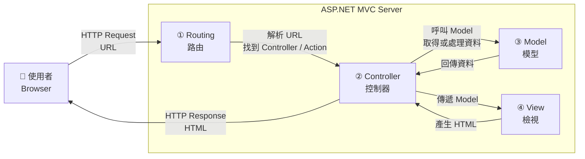

SQL (Structured Query Language 結構化查詢語) 是用來管理與查詢關聯式資料庫的標準化程式語言，常見的關聯式資料庫（DBMS) 有：

- MySql
- PostgresSql
- Microsoft SQL Server
- Oracle Database

SQL 指令主要分為以下幾種子語言：

- DQL（資料查詢語言）：如 SELECT，用於資料庫中檢索資料
- DDL（資料定義語言）：如 CREATE、ALTER、DROP，用於定義或修改資料庫結構
- DML（資料操作語言）：如 Insert、UPDATE、DELETE，用於新增、修改或刪除資料
- DCL（資料控制語言）：如 GRANT，用於管理資料庫的使用者權限與訪問控制

# SQL Injection

攻擊者透過 web security vulnerability 執行惡意指令導致資料外洩、篡改或刪除

### Postswigger

> SQL injection (SQLi) is a web security vulnerability that allows an attacker to interfere with the queries that an application makes to its database. This can allow an attacker to view data that they are not normally able to retrieve. This might include data that belongs to other users, or any other data that the application can access. In many cases, an attacker can modify or delete this data, causing persistent changes to the application's content or behavior.
> 

## 理解實際如何產生 SQL Injection

假設有一個頁面提供查詢各部門有哪人，使用者一次只能選擇一個部門查看，請求過程如下：

```csharp
http://localhost:8080/UserInfo?depid=1
```

Server 端架構大致如下



#### ASP MVC

#### View（前端，Front-end)

```html
@{
	ViewBag.Title = "使用者資料"
	..............
}
<form action='/UserInfo' method='get'>
	<select id='depid' name='depid'>
		<option value='1'>資訊</option>
		<option value='2'>廠務</option>
		<option value='3'>採購</option>
	</select>
	<input type='submit' value='查詢'/>
</form>
<hr/>
<table>
	<thead>
		<tr>
			<th>姓名</th>
			<th>分機</th>
		</tr>
	</thead>
	<tbody>
	.............................................
	</tbody>
</table>
```

#### Controller(後端，Back-end)

```csharp
public class UserController:Controller
{
	public ActionResult UserInfo(int depid)
	{
		UserInfoHelper helper = new UserInfoHelper();
		var user = helper.getUserinfo(depid);
		return View(user);
	}
}
```

#### Model

```csharp
//使用者資料結構
public class User
{
	public int DepartID{get;set;}
	public string Name{get;set;}
	public string Password{get;set;}
	public string Ext{get;set;}
}

//API
public class UserInfoHelper
{
	//取得使用者資料
	public List<User> getUserinfo(int id)
	{
		using(SqlConnection cn = new SqlConnection())
		{
			using(SqlCommand cmd = new SqlCommand())
			{
				cn.ConnectionString = "Data Source=<ip>;..........";
				cmd.Connection = cn;
				cmd.CommandText = $"select * from UserInfo where dep_id='{id}'";
				cn.open();
				using(SqlDataReader rd = new SqlDataReader())
				{
				.........................
				}
				cn.clost();
			}
		}
	}
}
```

#### Table Depart

| id | depart_name |
| --- | --- |
| 1 | 資訊 |
| 2 | 廠務 |
| 3 | 採購 |

#### Table UserInfo

| user_id | user_name | passwd | dep_id | ext |
| --- | --- | --- | --- | --- |
| AAA | 王XX | 123 | 1 | 10 |
| BBB | 李XX | 456 | 2 | 20 |
| CCC | 林XX | 789 | 3 | 30 |

而會造成 SQL Injection 就在於看似沒問題的 Code 只要變更傳入值，在 DQL 中就變味了

> cmd.CommandText = $"select * from UserInfo where dep_id='{id}'";
> 

```sql
--DQL
select * from UserInfo where dep_id='1'
```

重新請求傳入值改成 1 ‘ or  1=1 - -

```html

http://localhost:8080/UserInfo?depid=1' or 1=1 --
```

```sql
--DQL
select * from UserInfo where dep_id = '1' or 1=1 --'
```

- - 在 SQL 語句中，雙減號（- -）代表單行註解（Single-line Comment），’ 單引號用來包裹查詢字串，原程式碼中的兩個單引號被 payload 以單行註解隔開並下 or 條件，以致原本只能查單一部門的人員被變成所有人員可以一次撈出

> Lab
https://portswigger.net/web-security/sql-injection/lab-retrieve-hidden-data
> 

## 如何防止 SQL Injection

使用參數化查詢可用來防止 SQL Injection 如下：

> cmd.Parameters.AddWithValue("@id", id);
> 

```csharp
cn.ConnectionString = "Data Source=<ip>;..........";
cmd.Connection = cn;
cmd.CommandText = "select * from UserInfo where dep_id=@id";
cmd.Parameters.AddWithValue("@id", id);
```

另外須注意的是有些無法使用參數化查詢的，如 ORDER BY <欄位名稱>，通常開發者在無法避開參數化查詢下會改用連接字串來拼接 SQL 語法，因此會有機會讓攻擊者有注入機會

```csharp
cmd.CommandText = "select * from UserInfo where dep_id=@id order by " + column_name
// column_name 可能會被拼接成 "user_name;select * from information_schema.tables
// 被變相執行兩條 SQL 指令,而最後一條查詢給果會覆蓋掉第一條查詢
```

若非得要排序請不要在 SQL 中，應將排序拉到程式階段進行；如使用 Linq 及搭配驗證、正規化、Enum 來完成排序
